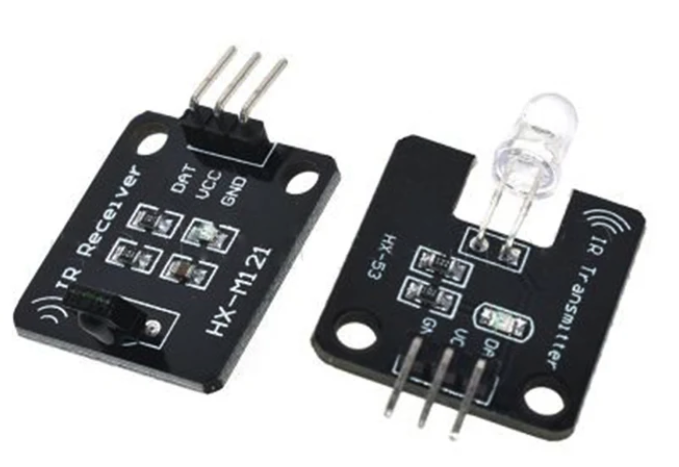
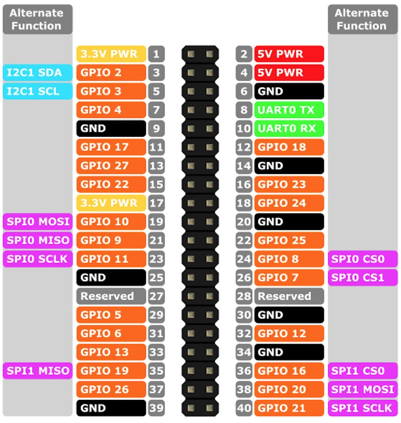

# Raspberry Pi IR Integracion de modulos IR

Este documento registra **el proceso real que me funcionó** para lograr **transmisión y recepción infrarroja (IR)** en una Raspberry Pi usando el stack del kernel (`/dev/lirc*`) y la herramienta **`ir-ctl`** (paquete `v4l-utils`).

> ⚠️ Importante: esto **no** pretende ser un tutorial universal. Documenta *mi* conexión + comandos + pruebas que funcionaron
---

## 1) Paquetes a instalar

Para hacer pruebas se debe instalar el paquete `v4l-utils` el cual incluye `ir-ctl`
```bash
sudo apt update
sudo apt install -y v4l-utils
```

---

## 2) Actualizar config.txt

Para que podamos usar los GPIO es necesario modificar el archivo 
`/boot/firmware/config.txt`

y agregar lo siguiente:
```ini
dtoverlay=gpio-ir,gpio_pin=18       #--> Receptor
dtoverlay=gpio-ir-tx,gpio_pin=23    #--> Emisor
```

### Concepto clave: Device Tree y dtoverlay
> Los dtoverlay permiten mapear pines GPIO físicos a drivers del kernel, los cuales exponen interfaces de software para acceder al hardware.

Luego de estos cambios reiniciar el sistema.

---

## 3) Verificación de dispositivos

Listar dispositvos LIRC:
```bash
ls -l /dev/lirc*
```

Resultado esperado:
- `/dev/lirc0` → transmisor
- `/dev/lirc1` → receptor

---

## 4) Hardware

### Receptor IR
- Módulo genérico 38kHz (VS1838, KY-022)
- Alimentación: **5V**
- OUT → GPIO18

<p align="center">
  
</p>


## 5) Conexión módulos

<p align="center">
  
</p>

**Emisor**:
* VCC -> PIN 2
* GND -> PIN 6
* DAT -> PIN 16 -> GPIO 23

**Receptor**:
* VCC -> PIN 4
* GND -> PIN 6
* DAT -> PIN 12 -> GPIO 18


## 6) Recepción y Emision IR – Modo RAW

Para poder recibir y probar en la raspbery si la conexion esta correcta se debe ejecutar el sigueinte comando en la terminal
```bash
sudo ir-ctl -r -d /dev/lirc1
```

### Explicación del comando
- `ir-ctl` : herramienta de control IR
- `-r` : modo receive (recibir)
- `-d /dev/lirc1` : dispositivo LIRC del receptor

El ejecutar el comando se queda a la escucha y al momento de apuntar y presionar el control
hacia el receptor deberia ver pulsos/espacios como:
```
+1290 -403 +1269 -405 +383 -1291 +1271 -403 +1271 -403 +407 -1267 +407 -1269 +425 -1248 ...
```

**Qué significa:**
- `+` = pulso (IR encendido)
- `-` = espacio (IR apagado)
- los números son duraciones (µs)
---

### 6.1 Grabar una señal a archivo .raw

Cuando queremos grabar una señal debemos hacer lo mismo pero simplemente redireccionando la salida a un archivo

```bash
sudo ir-ctl -r -d /dev/lirc1 > power.raw
```
---

### 6.2 Transmitir una señal guardada

Para transmitir la señal guardada lo hacemos de esta forma
```bash
sudo ir-ctl -d /dev/lirc0 -s power.raw
```

## 7) Loopback (TX → RX) para confirmar emisión

Se realizó una prueba de “loopback”:
- LED emisor apuntando al receptor a **1–2 cm**

Terminal A (RX):
```bash
sudo ir-ctl -r -d /dev/lirc1
```

Terminal B (TX):
```bash
sudo ir-ctl -d /dev/lirc0 -s power.raw
```

### Capitulos de youtube
-----
Videos con el proceso de configuración y pruebas 

1. [Configuración y uso de control](https://www.youtube.com/watch?v=7I1J5ifFpYI)
